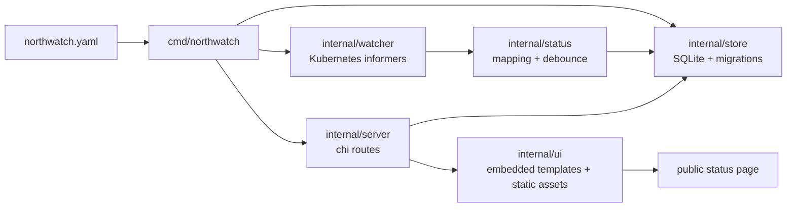

# Architecture Overview

NorthWatch is a single Go process. `cmd/northwatch` owns startup:
parse flags, open SQLite, apply migrations, load `northwatch.yaml`,
sync the desired component set, build the Kubernetes client, start the
HTTP server, and launch resource watchers.

## Runtime pieces

`cmd/northwatch` is the composition root. It supports `serve` and
`migrate`. If no subcommand is passed, `serve` is used. The server
defaults are intentionally local-friendly: `:8080` for HTTP,
`./northwatch.db` for SQLite, and `northwatch.yaml` for config.

`internal/config` parses and validates the component declaration file.
It accepts `Deployment`, `HelmRelease`, `Kustomization`, and
`Application`. The config package is a leaf package; translation into
store shapes happens in `cmd/northwatch`.

`internal/store` defines the persistence contract. SQLite is the only
implementation today. The store owns migrations, component upserts,
component config sync, incident creation, incident resolution, and
read APIs used by the HTTP layer.

`internal/watcher` owns Kubernetes integration. The Deployment watcher
uses typed client-go informers. Flux and ArgoCD resources use dynamic
informers gated by CRD discovery probes so clusters without those CRDs
can still boot.

`internal/status` contains pure status mapping plus the downward
transition debouncer. Watchers call into this package before writing
component state to the store.

`internal/server` wires chi routes. Reads are public. Incident writes
are protected by a bearer token. The public page is server-rendered
HTML; the status section refreshes through HTMX polling.

`internal/ui` embeds Go templates, compiled Tailwind CSS, and HTMX so
the binary can run without external static files.

## Package direction

The architecture is intentionally one-way:

- config, component, incident, and status packages do not depend on
  HTTP or Kubernetes wiring.
- watchers depend on config, status, component, and store.
- server depends on store and incident service interfaces, not on
  watcher internals.
- cmd depends on everything because it assembles the process.

Keep new behavior close to the package that owns it. For example,
status interpretation belongs in `internal/status`, while informer
event handling belongs in `internal/watcher`.
