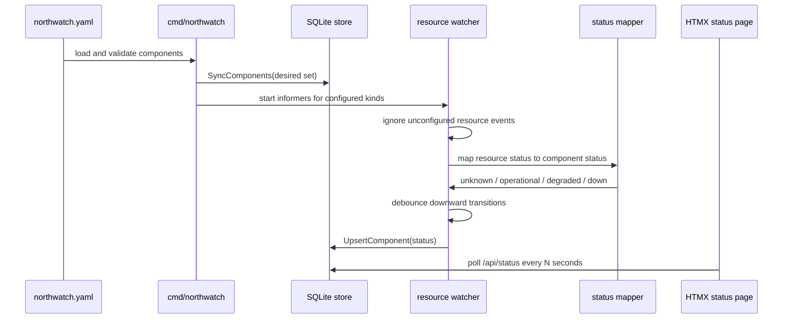

# Status Derivation

NorthWatch derives component health from Kubernetes resource state.
The YAML config decides which resources are watched; the cluster
decides the current status.

## Source kinds

`Deployment` uses `apps/v1` typed informers and maps from
`status.conditions` plus replica readiness:

- `Progressing=True`, `reason=NewReplicaSetAvailable`, and ready
  replicas at least desired replicas -> `operational`
- `Progressing=False`, `reason=ProgressDeadlineExceeded` -> `down`
- ready replicas `0` -> `down`
- ready replicas below desired replicas -> `degraded`
- otherwise -> `operational`

Flux `HelmRelease` and Flux `Kustomization` use kstatus-style
conditions. NorthWatch checks fresh `Stalled`, `Ready`, and
`Reconciling` conditions in that order:

- `Stalled=True` -> `down`
- `Ready=True` -> `operational`
- `Ready=False`, `reason=Progressing` -> `degraded`
- `Ready=False` with another reason -> `down`
- `Reconciling=True` -> `degraded`
- no trusted signal -> `unknown`

A condition is trusted when `observedGeneration` is absent or is at
least the resource generation. This supports older controllers that do
not stamp `observedGeneration` while ignoring explicitly stale
conditions.

ArgoCD `Application` maps from `status.health.status`:

- `Healthy` -> `operational`
- `Progressing` -> `degraded`
- `Degraded` or `Missing` -> `down`
- `Unknown`, missing, empty, or unrecognized -> `unknown`
- `Suspended` preserves the previous stored status and writes nothing

## CRD discovery

Deployment watching is always available when Kubernetes access works.
Flux and ArgoCD watchers are optional:

- `HelmRelease` probes the served Flux HelmRelease API versions and
  picks the newest supported version.
- `Kustomization` probes for
  `kustomize.toolkit.fluxcd.io/v1/kustomizations`.
- `Application` probes for `argoproj.io/v1alpha1/applications`.

Missing CRDs are normal. NorthWatch logs that the watcher is skipped
and continues serving the remaining components.

## Debounce rules

Each watcher owns its own debouncer. The default window is 60 seconds
and can be changed with `--debounce-seconds` or
`NORTHWATCH_DEBOUNCE_SECONDS`.

Downward transitions are held for the debounce window to avoid page
flicker during rollouts. Upward transitions write immediately.
Transitions involving `unknown` also write immediately because losing
or regaining signal is meaningful on its own.

When the debounce timer fires, the watcher re-reads the object from
the informer lister and remaps current state before writing. If the
object disappeared, the pending entry is forgotten.

## UI refresh path

The status page is not pushed by the watchers. Watchers only update
SQLite. The browser polls `/api/status` with HTMX every
`PollSeconds` seconds and swaps the rendered status section. The
default poll interval is 5 seconds.
