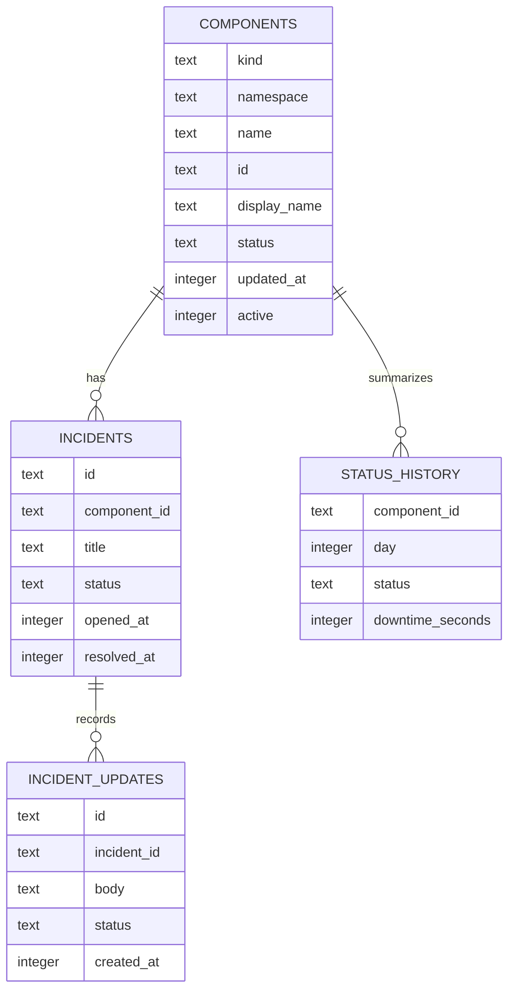

# Data Model

The domain model is small and mirrors the SQLite schema. Components
represent watched resources. Incidents represent operator-declared
events affecting a component. Incident updates record the timeline for
an incident.



## Components

The canonical component ID is:

```text
<kind>/<namespace>/<name>
```

SQLite stores `components.id` as a generated column from those three
fields. The same format is returned by `component.Component.ID()` and
used by watchers, incidents, and API responses.

Component status is one of:

- `unknown`
- `operational`
- `degraded`
- `down`

`updated_at` is written by the store when status is upserted. It tracks
status update time, not config sync time.

`active` separates current desired components from historical rows.
When a component disappears from config, `SyncComponents` can
soft-deactivate it with `active=0` instead of deleting it. Public list
queries return only active components.

## Incidents

Incidents are tied to components by `component_id`. The service refuses
to create an incident for a missing or inactive component.

Incident status is one of:

- `investigating`
- `identified`
- `monitoring`
- `resolved`

The current write surface creates incidents and resolves incidents.
`CreateIncident` inserts the incident and its first timeline row in a
single transaction. `ResolveIncident` marks the incident resolved and
inserts a resolved timeline row in a single transaction.

## Incident updates

`incident_updates` is the timeline table. It is already part of the
schema, and the create/resolve paths write to it. A general
`POST /incidents/:id/updates` endpoint is a later v0.2 task.

## Status history

`status_history` is reserved for daily availability summaries. The
table exists now so migrations can evolve safely, but current v0.1
watcher writes do not populate it. Issue #74 tracks populating this
table on component state transitions.

## Persistence behavior

SQLite is the only supported database in v0.1. The binary default path
is `./northwatch.db`; the container image defaults to
`/var/lib/northwatch/northwatch.db`.

`northwatch serve` applies migrations on startup. `northwatch migrate`
applies pending migrations and exits, which is useful when an operator
wants to run database migration separately from serving traffic.
