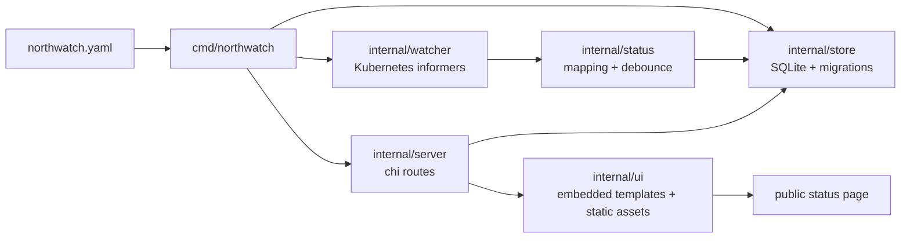

# Runtime Model

NorthWatch runs as one process. On startup it reads runtime flags and
environment variables, opens SQLite, applies migrations, loads
`northwatch.yaml`, syncs the desired component set, connects to
Kubernetes, starts the HTTP server, and launches resource watchers.

## Runtime pieces

The `northwatch` binary supports `serve` and `migrate`. If no subcommand
is passed, `serve` is used. The server defaults are intentionally
local-friendly: `:8080` for HTTP, the user's XDG data directory for
SQLite, and `northwatch.yaml` for config.

The component config declares the Kubernetes resources NorthWatch should
watch. It accepts `Deployment`, Flux `HelmRelease`, Flux
`Kustomization`, and ArgoCD `Application`.

SQLite is the only persistence backend today. NorthWatch uses it for
components, incidents, incident timeline rows, and migration state.

Kubernetes watchers keep component status current. Deployment watching
uses typed informers. Flux and ArgoCD resources use dynamic informers
that start only when the corresponding CRDs are present, so clusters
without those controllers can still run NorthWatch.

Status mapping turns resource conditions into one of `unknown`,
`operational`, `degraded`, or `down`. Downward transitions are debounced
by default so normal rollouts do not cause avoidable page flicker.

The HTTP server exposes a public status page, public read APIs, a
health check, and bearer-token-protected incident write endpoints. The
public page is server-rendered HTML; the status section refreshes
through HTMX polling.
